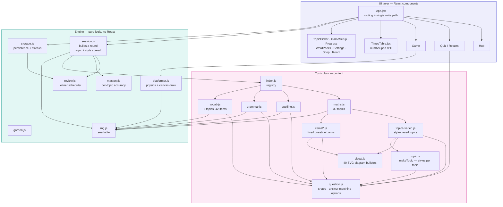
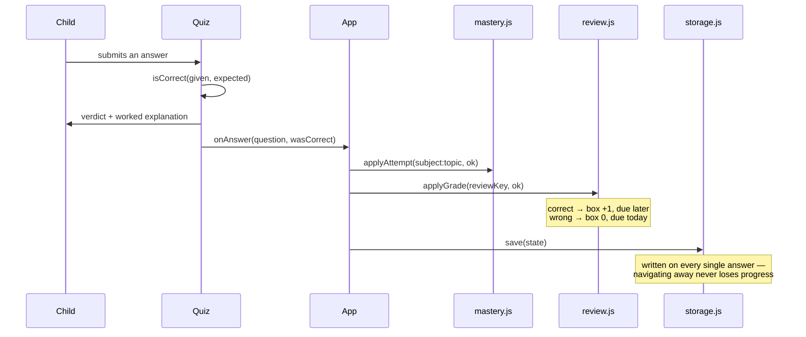

# Brain Blast — system design

## Component map



### Why topics are built from styles

A topic used to be a single `generate(rng)` with a hidden `rng.int(0, n)` switch.
Nothing in the code stated how many *kinds* of question a topic could ask, so
topics quietly drifted into asking one thing with different numbers — BODMAS
served nothing but bare sums, "Reading graphs" only ever drew a bar chart.

`makeTopic(id, label, level, styles)` makes that explicit. Each style is a small
pure builder with an id, and every question carries the `styleId` it came from.
Two things follow:

* **Open/closed** — a new kind of question is a new entry in the array. No
  existing branch changes.
* **Variety becomes enforceable** — `session.js` can require a *mix* of styles
  rather than hoping random sampling produces one. Pinning a topic walks a
  shuffled cycle of its styles, so a ten-question section covers every kind of
  question that topic can ask before repeating any.

Every diagram carries a `data-kind` attribute naming the helper that drew it,
so "does this topic vary its pictures?" is a query the test suite runs rather
than a judgement call.

The dependency arrows only ever point **downward**: UI depends on engine, engine
depends on curriculum, curriculum depends on nothing but its own question shape.
No engine module imports React, which is why the whole engine is testable in
plain Node and why the game loop can mutate state at 60 fps without dragging
React's render cycle along with it.

## What happens when a question is answered



## The two units of tracking

These are deliberately different things, and conflating them was the main
design decision:

| | **Mastery** | **Review** |
|---|---|---|
| Keyed by | `subject:topic` | `reviewKey` per item |
| Answers | "is she good at fractions?" | "does she still know *accommodate*?" |
| Window | last 10 attempts | Leitner box 0→5 |
| Drives | which topics questions are drawn from | which questions come back, and when |

`reviewKey` is intentionally coarser for maths than for spelling. A spelling
word *is* the thing being learned, so a review shows that same word. A maths
skill is the thing being learned, so a review of `maths:fractions` generates a
fresh fractions question with different numbers — otherwise she would memorise
one answer rather than the method.

## Round composition

```
buildRound(subject)
  1. due reviews for this subject      → capped at 4 of 10
  2. new questions                     → 45% drawn from weakest topics
  3. de-duplicate                      → by item (spelling/grammar)
                                       → by prompt text (maths)
```

The cap matters: a round that is entirely review feels like punishment for
having got things wrong. Four is enough to move the schedule without the round
losing its shape.

## Spaced repetition intervals

| Box | Next review | Meaning |
|---|---|---|
| 0 | same day | just missed it |
| 1 | 1 day | |
| 2 | 3 days | |
| 3 | 7 days | |
| 4 | 21 days | |
| 5 | retired | learned |

A wrong answer always resets to box 0, whatever box it was in.

## Testing

109 tests, all pure Node — no DOM, no test renderer.

| File | Covers |
|---|---|
| `review.test.js` | scheduling, promotion, lapses, due ordering |
| `mastery.test.js` | rolling accuracy, status bands, weak-topic ranking |
| `curriculum.test.js` | **every topic × 60 seeds**: answers valid, options unique, exactly one correct option, no NaN in prompts; maths verified independently (BODMAS evaluated as a real expression, triangle angles sum to 180, algebra solutions substituted back) |
| `session.test.js` | round composition, review cap, subject isolation, weak-topic bias, determinism |
| `storage.test.js` | persistence, corrupt-save recovery, forward migration, streaks, garden |
| `platformer.test.js` | jump arc, coyote time, respawn safety, gate open/retry, and the fairness invariant that **no gap is ever wider than the character can jump at any speed or difficulty** |

Run with `npm test`.

## Build

```
npm run dev      # Vite dev server
npm test         # Vitest
npm run build    # dist/
npm run bundle   # brainblast.html — one file, no network at all
```

The single file is a *packaging step*, not the source. It inlines the JS and
CSS and deliberately drops the web-font link so the app works with no
connection whatsoever.
